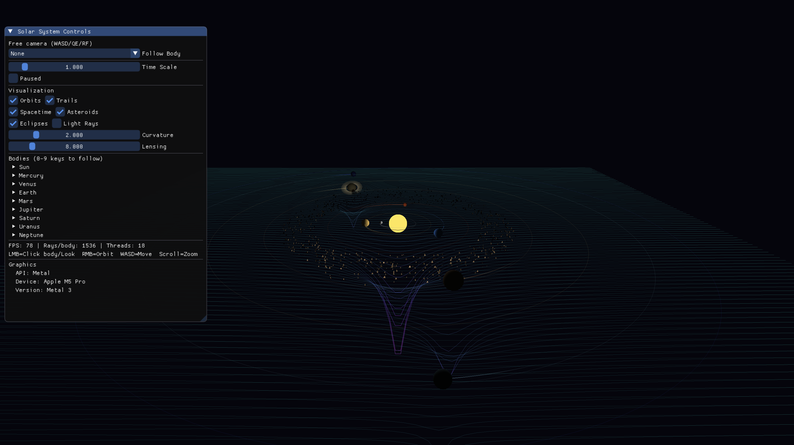

# GeniusEngine

Perhaps not the most Genius, but it tries its best...


A hobby C++20 game engine exploring clean graphics API abstraction across multiple backends.

- **Backend-agnostic rendering** — one `IShader`/`IBuffer`/`ITexture` interface, three implementations
- **Lifecycle-driven app model** — subclass `Application`, override hooks, the engine does the rest
- **Declarative UI panels** — subclass `Panel`, define `layout()`, bind data
- **Input abstraction** — `input().isKeyDown(Key::W)` instead of raw GLFW

Ships with a solar system demo featuring relativistic light transport, spacetime curvature, and a 1000-asteroid belt — all running in parallel via OpenMP.



## Building

```bash
./configure.sh    # detects platform, generates build.config
make              # builds engine libs + demo binary
./run.sh          # runs the solar system demo
```

Dependencies: GLFW, GLM (both auto-detected via pkg-config or Homebrew). OpenMP via `libomp` on macOS.

## Architecture

```
┌──────────────────────────────────────────────────────┐
│                    Application                        │
│  ┌─────────────────────────────────────────────────┐ │
│  │  Your Game (subclass GE::Application)           │ │
│  │  configure() → onInit() → onInput/Update/Render │ │
│  └──────────────┬──────────────────────────────────┘ │
│                 │ uses                                │
│  ┌──────────────▼──────────────────────────────────┐ │
│  │              Engine Core                         │ │
│  │  ┌────────┐ ┌────────┐ ┌──────┐ ┌────────────┐ │ │
│  │  │ Camera │ │Renderer│ │ Mesh │ │  Material   │ │ │
│  │  │  Input │ │        │ │      │ │  (Shader +  │ │ │
│  │  │        │ │drawMesh│ │create│ │  Properties)│ │ │
│  │  │ orbit, │ │drawLine│ │update│ │             │ │ │
│  │  │ fly,   │ │        │ │      │ │             │ │ │
│  │  │ follow │ │        │ │      │ │             │ │ │
│  │  └────────┘ └───┬────┘ └──────┘ └─────────────┘ │ │
│  │                 │                                 │ │
│  │  ┌──────────────▼──────────────────────────────┐ │ │
│  │  │      Graphics (GE::Graphics abstraction)     │ │ │
│  │  │  IShader · IVertexBuffer · IVertexArray      │ │ │
│  │  │  ITexture · IFramebuffer                     │ │ │
│  │  ├────────────┬─────────────┬──────────────────┤ │ │
│  │  │ OpenGL 4.1 │ Metal (mac) │ Vulkan (MoltenVK)│ │ │
│  │  └────────────┴─────────────┴──────────────────┘ │ │
│  │                                                   │ │
│  │  ┌───────────────────────────────────────┐       │ │
│  │  │        UI (GE::UI — ImGui wrapper)    │       │ │
│  │  │  panels · sliders · trees · combos    │       │ │
│  │  │  Panel subclass for declarative UI    │       │ │
│  │  └───────────────────────────────────────┘       │ │
│  └───────────────────────────────────────────────────┘ │
└──────────────────────────────────────────────────────┘
```

## Writing a Game

The entire API surface for a game is one class and one macro. The engine owns `main()`, the run loop, and frame timing. You just fill in lifecycle hooks:

```cpp
#include "engine/Application.hpp"

using namespace GE;

class MyGame : public Application
{
    void configure(EngineConfig& config) override
    {
        config.window.width = 1280;
        config.window.height = 720;
        config.window.title = "My Game";
        config.window.backend = Graphics::Backend::Metal;
    }

    void onInit() override
    {
        // Load meshes, textures, set up scene
        m_shader = renderer().createDefaultShader();
        m_mesh = Mesh::generateSphere(1.0f, 32, 32);
    }

    void onInput(float dt) override
    {
        if (input().isKeyDown(Key::W))
            camera().moveForward(10.0f * dt);
        if (input().isKeyPressed(Key::Escape))
            input().requestClose();
    }

    void onUpdate(float dt) override
    {
        // Simulation, physics, AI
    }

    void onRender() override
    {
        Transform t;
        renderer().drawMesh(m_mesh, m_material, t);
    }

    void onUI() override
    {
        ui().beginPanel("Debug");
        ui().text("Hello");
        ui().endPanel();
    }
};

GE_APP(MyGame)
```

## API Reference

### Application Lifecycle

| Method | When | Purpose |
|--------|------|---------|
| `configure(config)` | Before engine init | Set window size, title, backend |
| `onInit()` | After engine + UI ready | Load assets, create meshes |
| `onInput(dt)` | Every frame, before update | Handle input |
| `onUpdate(dt)` | Every frame | Simulation / game logic |
| `onRender()` | Every frame, inside begin/endFrame | Issue draw calls |
| `onUI()` | Every frame, inside ImGui frame | Draw UI widgets |
| `wantsUI()` | Every frame | Return `false` to hide UI |
| `onShutdown()` | On exit | Release resources |

### Engine Access (from Application)

```cpp
engine()      // GE::Engine&    — frame timing, window
renderer()    // GE::Renderer&  — draw calls, shader creation
camera()      // GE::Camera&    — view/projection, orbit, fly, follow
window()      // GE::Window&    — native handle, resize
input()       // GE::Input&     — keyboard, mouse, scroll
ui()          // GE::UI::UI&    — widget API
deltaTime()   // float          — frame delta in seconds
time()        // float          — elapsed time
```

### Camera

Supports three modes of operation. All modes can coexist — orbiting works whether following a target or not.

```cpp
// Orbit around current target
camera().orbit(deltaYaw, deltaPitch, deltaDistance);

// Free-fly (WASD-style)
camera().moveForward(amount);
camera().moveRight(amount);
camera().moveUp(amount);
camera().rotateYaw(angle);
camera().rotatePitch(angle);

// Follow a world position (camera maintains offset)
camera().follow(worldPos);

// Direct control
camera().lookAt(eye, target, up);
camera().setPosition(pos);
camera().setTarget(target);
```

`Camera` is a virtual base class — subclass it to implement custom behaviors (rail cameras, cinematic paths, etc.).

### Mesh

```cpp
// Primitives
auto sphere = Mesh::generateSphere(radius, sectors, stacks, color);
auto grid   = Mesh::generateGrid(size, divisions, color);
auto circle = Mesh::generateCircle(radius, segments, color);

// Dynamic meshes (for trails, procedural geometry)
mesh.createDynamic(maxVertices);
mesh.updateVertices(vertexVector);

// Manual construction
mesh.create(vertices, indices, usage);
```

`Mesh` is a virtual base class — override `draw()` for custom rendering.

### Renderer

```cpp
renderer().drawMesh(mesh, material, transform);           // Full lit draw
renderer().drawMeshSimple(mesh, shader, transform);       // Shader-only draw
renderer().setLight(light);                                // Set scene light

auto shader = renderer().createDefaultShader();            // Phong
auto shader = renderer().createUnlitShader();              // Flat color
auto shader = renderer().createLineShader();               // Lines/trails
```

### Asset Loading

The engine provides loaders for shaders, textures, and OBJ models via `AssetLoader.hpp`:

**Shaders** — Engine shaders live in `src/shaders/{opengl,metal,vulkan}/`. Custom app shaders follow the same backend subfolder convention:

```cpp
#include "engine/AssetLoader.hpp"
using namespace GE;

// Load a built-in engine shader by name
auto shader = ShaderLoader::load("default");   // src/shaders/{backend}/default.*
auto shader = ShaderLoader::load("unlit");     // src/shaders/{backend}/unlit.*
auto shader = ShaderLoader::load("line");      // src/shaders/{backend}/line.*

// Load a custom shader from your app's shader folder
// Expects: src/app/shaders/{opengl,metal,vulkan}/dissolve.{vert,frag,metal}
auto shader = ShaderLoader::loadCustom("dissolve", "src/app/shaders");
```

Shader file conventions per backend:

| Backend | Files needed |
|---------|-------------|
| OpenGL  | `name.vert` + `name.frag` (GLSL 4.1) |
| Vulkan  | `name.vert` + `name.frag` (GLSL 4.5, compiled to SPIR-V at runtime via shaderc) |
| Metal   | `name.metal` (single file with `vertexMain` + `fragmentMain`) |

**Textures** — Supports PNG, JPG, BMP, TGA via stb_image:

```cpp
auto texture = TextureLoader::load("assets/earth_diffuse.png");

Material mat;
mat.setShader(shader);
mat.setTexture(texture);
```

**OBJ Models** — Loads Wavefront OBJ with triangulation:

```cpp
auto meshData = ModelLoader::loadOBJ("assets/spaceship.obj");

// Each entry is a named mesh group with vertices + indices
for (auto& loaded : meshData)
{
    Mesh mesh;
    mesh.create(loaded.vertices, loaded.indices);
    // Use mesh...
}
```

### Mesh Vertex Access

Meshes store a CPU-side copy of their vertices for manipulation (e.g. baking lighting):

```cpp
auto& verts = mesh.getVertices();          // const ref for read
auto& verts = mesh.getVertices();          // mutable ref for write
mesh.updateVertices(modifiedVertices);     // upload to GPU
```

### UI

Two approaches: direct widget calls, or subclass `Panel` for declarative layouts.

**Direct (in onUI)**:
```cpp
ui().beginPanel("Title");
ui().text("Hello");
ui().textColored({1,0,0,1}, "Red text");
ui().button("Click");
ui().checkbox("Option", boolRef);
ui().sliderFloat("Speed", floatRef, 0, 10);
ui().endPanel();
```

**Panel subclass** (reusable, separates layout from logic):
```cpp
class DebugPanel : public GE::UI::Panel {
public:
    float speed = 1.0f;
    bool wireframe = false;
    int selectedItem = 0;
    Vec3 lightDir = {0, 1, 0};

    void layout() override {
        // Basic widgets
        label("FPS: " + std::to_string(fps));
        labelColored({1, 0.5f, 0, 1}, "Warning: low FPS");
        separator();

        // Value controls
        slider("Speed", speed, 0.0f, 10.0f);
        slider3("Light Dir", lightDir, -1.0f, 1.0f);
        inputFloat("Speed (precise)", speed, 0.01f);
        checkbox("Wireframe", wireframe);
        colorEdit("Sky", skyColor);

        // Dropdown combo
        if (beginCombo("Mode", modes[selectedItem])) {
            for (int i = 0; i < 3; ++i)
                if (selectableItem(modes[i], i == selectedItem))
                    selectedItem = i;
            endCombo();
        }

        // Collapsible tree
        if (treeNode("Advanced")) {
            slider("Gamma", gamma, 0.1f, 3.0f);
            treePop();
        }

        // Or use section() for cleaner collapsibles
        section("Debug", [&] {
            label("Draw calls: " + std::to_string(drawCalls));
            progressBar(gpuLoad, "GPU");
        });

        // Layout helpers
        spacing();
        if (button("Reset")) resetAll();
        sameLine();
        if (button("Apply", {100, 30})) apply();
    }
};

// In your app:
DebugPanel m_debugPanel{"Controls"};

void onUI() override {
    m_debugPanel.draw(ui());
}
```

**Panel Widget Reference:**

| Widget | Signature | Notes |
|--------|-----------|-------|
| `label` | `(string)` | Static text |
| `labelColored` | `(Color, string)` | Tinted text |
| `separator` | `()` | Horizontal line |
| `spacing` | `()` | Vertical gap |
| `sameLine` | `(offset=0)` | Next widget on same line |
| `button` | `(label, size={0,0}) → bool` | Returns true on click |
| `checkbox` | `(label, bool&) → bool` | Toggle |
| `slider` | `(label, float&, min, max) → bool` | Float slider |
| `slider3` | `(label, Vec3&, min, max) → bool` | 3-component slider |
| `colorEdit` | `(label, Vec3&) → bool` | RGB color picker |
| `inputFloat` | `(label, float&, step) → bool` | Numeric input |
| `beginCombo` | `(label, preview) → bool` | Start dropdown |
| `selectableItem` | `(label, selected) → bool` | Dropdown option |
| `endCombo` | `()` | End dropdown |
| `treeNode` | `(label) → bool` | Collapsible section start |
| `treePop` | `()` | End collapsible section |
| `progressBar` | `(fraction, overlay)` | 0.0–1.0 bar |
| `section` | `(label, lambda)` | Tree node + auto-pop |

### Input

Backend-agnostic input — no GLFW in your game code:

```cpp
// Keys (held / edge-triggered)
input().isKeyDown(Key::W)        // true while held
input().isKeyPressed(Key::Space) // true on frame pressed
input().isKeyReleased(Key::Tab)  // true on frame released

// Mouse
input().isMouseDown(MouseButton::Left)
input().isMousePressed(MouseButton::Left)  // click start
input().isMouseReleased(MouseButton::Left) // click end
input().getMousePosition()  // Vec2
input().getMouseDelta()     // Vec2

// Scroll & window
input().getScrollDelta()    // float
input().requestClose()      // close the window
```

## Solar System Demo

The bundled demo (`src/app/`) simulates a 9-body solar system with several technically interesting features:

### Omnidirectional Raycaster

2048 × 5 rays cast radially from the sun's surface across the orbital plane and neighboring elevation layers. Each ray is traced along a curved geodesic — gravitational lensing deflects light near massive bodies using a weak-field Schwarzschild approximation ($\text{deflection} \propto M/r^2$). When a ray hits an intermediate body before reaching another, the shadowed body receives per-vertex darkening with angular interpolation.

### Spacetime Curvature Mesh

A 120×120 vertex grid deforms in real time to visualize gravitational wells. Depression depth follows a metric-inspired formula: $d = -\sum_i \frac{G \cdot M_i}{(r + r_s)^{1.4}}$ where $r_s$ is a softening radius proportional to the body's visual size. The sun's far-field contribution is exponentially damped to prevent global flattening.

### Asteroid Belt

1000 asteroids between Mars and Jupiter, each with Kepler-scaled orbital speed ($v \propto 1/\sqrt{r}$), rendered as irregular tetrahedra in a single batched draw call (12,000 vertices). Both orbital integration and vertex generation are parallelized via OpenMP.

### Controls

| Key | Action |
|-----|--------|
| WASD | Move camera (breaks follow) |
| Q / E | Rotate camera yaw |
| R / F | Camera up / down |
| LMB drag | Orbit around target |
| Scroll | Zoom |
| 0-9 | Follow body (Sun=0, Mercury=1, ...) |
| Space | Pause simulation |
| Tab | Toggle UI |
| Esc | Quit |

## Project Structure

```
src/
├── shaders/                      # Engine shaders (all backends)
│   ├── opengl/                   # GLSL 4.1 (.vert + .frag)
│   ├── metal/                    # MSL (.metal)
│   └── vulkan/                   # GLSL 4.5 → SPIR-V (.vert + .frag)
├── app/                          # Demo application
│   ├── SolarSystemApp.cpp        # Main app class (lifecycle hooks)
│   └── solarsystem/              # Solar system support files
│       ├── CelestialBody.hpp     # Planet/star data struct
│       ├── SolarSystemPanel.hpp  # Declarative UI panel
│       ├── SpacetimeGrid.hpp     # Curvature visualization
│       ├── AsteroidBelt.hpp      # Parallel asteroid simulation
│       ├── Raycaster.hpp         # Omnidirectional light transport
│       └── TrailRenderer.hpp     # Orbital trail meshes
├── engine/                       # Core engine (GE namespace)
│   ├── Application.hpp           # Base class (lifecycle-driven)
│   ├── Engine.hpp/cpp            # Ties window + renderer + camera + input
│   ├── Input.hpp/cpp             # Backend-agnostic input
│   ├── Camera.hpp/cpp            # Virtual camera (orbit/fly/follow)
│   ├── Mesh.hpp/cpp              # Virtual mesh (static/dynamic)
│   ├── Material.hpp/cpp          # Shader + property binding
│   ├── Renderer.hpp/cpp          # High-level draw API
│   ├── AssetLoader.hpp           # ShaderLoader, TextureLoader, ModelLoader
│   └── Scene.hpp/cpp             # Scene graph
├── graphics/                     # Graphics abstraction (GE::Graphics)
│   ├── GAPI.hpp                  # Interface definitions
│   ├── Factory.hpp/cpp           # Backend factory
│   ├── opengl/                   # OpenGL 4.1 implementation
│   ├── metal/                    # Metal implementation (macOS)
│   └── vulkan/                   # Vulkan implementation (MoltenVK)
├── ui/                           # UI layer (GE::UI)
│   ├── UI.hpp/mm                 # ImGui wrapper
│   └── Panel.hpp/cpp             # Declarative panel base class
└── core/
    └── Types.hpp                 # Vec3, Mat4, Color, Vertex, Transform
```

## License

MIT
